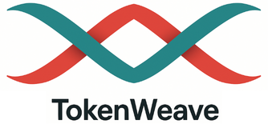
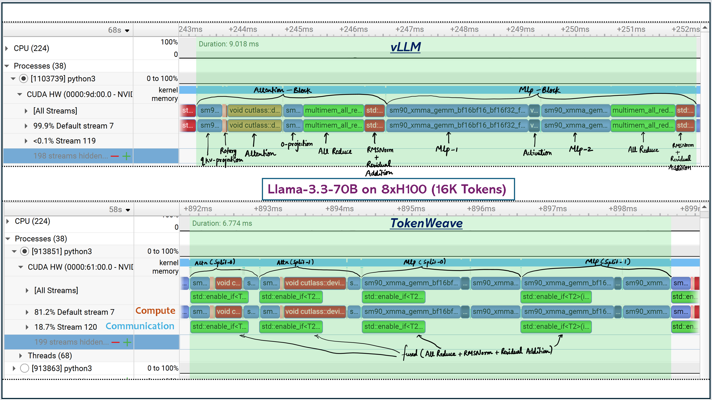

<p align="center">
  <picture>
    
  </picture>
</p>

<h3 align="center">
Efficient Compute-Communication Overlap for Distributed LLM Inference
</h3>

<p align="center">
| <a href="https://arxiv.org/abs/2505.11329"><b>Paper</b></a> | <strong>Accepted to MLSys 2026</strong> |
</p>

## Overview

**TokenWeave** is a system designed to reduce communication overhead during distributed inference of large language models (LLMs). Even with high-speed interconnects like NVLink, distributed inference can incur up to *20% performance overhead* due to communication bottlenecks.

TokenWeave addresses this by introducing a **coarse-grained compute-communication overlap** mechanism that significantly improves efficiency during inference. TokenWeave is currently integrated with `LLama-3.3-70B`, `Qwen2.5-72B` and `Mixtral-8x22B` but it can be easily extended to other similar models by modifying the model file. Please see <a href="docs/AddTokenWeave.md">how we modify `llama.py` to integrate TokenWeave</a> for the steps required to integrate TokenWeave into an existing model file. Additionally, please check <a href="csrc/tokenweave_fused_kernels.cu">`csrc/tokenweave_fused_kernels.cu`</a> for the TokenWeave fused kernels used to implement compute-communication overlap.

### TokenWeave NVIDIA Nsight Systems (nsys) profile

<p align="center">
  <picture>
    
  </picture>
</p>

## Prerequisites

- **Compilation**: CUDA 12.4  
- **Runtime environment**: Python 3.12, PyTorch 2.6.0, Ubuntu 22.04  
- **Hardware**: 8×H100 DGX system with NVLink interconnects

## Installation

To ease the setup, we recommend using either of these two Docker images:
- `pytorch/pytorch:2.6.0-cuda12.4-cudnn9-devel` or 
- `vllm/vllm-openai:v0.8.5`
```bash
apt-get update; apt-get upgrade -y; apt-get install kmod git build-essential tmux -y   
git clone https://github.com/microsoft/tokenweave.git
cd tokenweave
# Install miniconda; skip if already installed
make install_miniconda # 30 seconds
make create_env
bash # Refresh shell and activate
conda activate tokenweave
make install # 18 minutes # or alternatively: pip3 install -v -e .
make install_dependencies # 17 seconds
```

## Quick Start
To get started with TokenWeave:
```bash
huggingface-cli login --token HF_TOKEN
# Run offline inference examples
make run_qwen2
make run_mixtral
make run_llama3
# NOTE: If Llama 3 gets stuck during the model downloading stage, 
# please kill the process and start it again — that should resolve the issue.
# Note: vLLM version 0.8.5.post1 may also hang during model downloading, depending 
# on the environment setup.
```
**To Generate Tokenweave Configs (Optional)**

If you want to generate TokenWeave configs for a new model, you can use the configs_generator script and modify it as needed. We have already provided configs for `LLama-3.3-70B`, `Qwen2.5-72B` and `Mixtral-8x22B` on 8xH100.

```bash
cd artifact
tmux new -s tokenweave_session  # Start a new tmux session
conda activate tokenweave       # Activate the conda environment
# Run the following command in the tmux session to generate configs for
# `LLaMA-3.3-70B`, `Qwen2.5-72B`, and `Mixtral-8x22B`
make configs_generator          # Takes approximately 1 day
cd .. # Go back to the tokenweave directory
```

**To profile using nsys**
```bash
# install nsys
wget https://developer.nvidia.com/downloads/assets/tools/secure/nsight-systems/2024_4/NsightSystems-linux-cli-public-2024.4.1.61-3431596.deb
dpkg -i NsightSystems-linux-cli-public-2024.4.1.61-3431596.deb
# run
nsys profile -o report.nsys-rep --trace-fork-before-exec=true --cuda-graph-trace=node <script_name> <arguments>
```

## Benchmarks

Our evaluation includes two types of experiments:
- Microbenchmark performance
 (Figures 1, 2, 4, 5, 6, and 7)

- End-to-end LLM performance
 (Figures 8, 9, and 10)

To reproduce the results, use the `Makefile` in the `artifact/` directory:
```bash
cd artifact
tmux new -s tokenweave_session # start a new tmux session
conda activate tokenweave # activate the conda environment
# run the following commands in the tmux session
make clean
make correctness_check # check output/ directory for the raw text generated
make all # ~10 hours 48 minutes
# To generate the figures piece-wise
make figure_5_6_7 # 20 minutes
make table_1_figure_7 # 1 hour 25 minutes
make figure_5 # 8 minutes
make figure_1 # 3 hours 25 minutes
make figure_2_10 # 1 hour 10 minutes
make figure_8 # 2 hours 34 minutes
make figure_9 # 1 hour 52 minutes
```
The artifact scripts redirect the raw output numbers and logs to the `output/` folder, while the plotted graphs are stored
in the `graphs/` folder. CSV files for the figures can be found in the `csvs/` directory. Results may show minor runtime 
variations compared to those reported in the paper, but the general trends should remain consistent.

## Citation

If you use our work, please consider citing our [paper](https://arxiv.org/abs/2505.11329):

```bibtex
@misc{gond2025tokenweave,
  title={TokenWeave: Efficient Compute-Communication Overlap for Distributed LLM Inference},
  author={Raja Gond and Nipun Kwatra and Ramachandran Ramjee},
  year={2025},
  url={https://arxiv.org/abs/2505.11329}
}
```

## Acknowledgment

This repository originally started as a fork of the [vLLM project](https://github.com/rajagond/vllm/tree/87aaadef73543ab3e63eea933c39cee42c418e90) (Commit ID: 87aaade). Multimem-NVLS communication collective operation kernels in TokenWeave are built on top of the [pytorch implementation](https://github.com/pytorch/pytorch/blob/f6275bf0fe198f7f27569776ec221eb040a4cfa2/torch/csrc/distributed/c10d/CUDASymmetricMemoryOps.cu).
