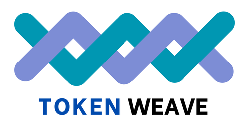

<p align="center">
  <picture>
    
  </picture>
</p>

<h3 align="center">
Efficient Compute-Communication Overlap for Distributed LLM Inference
</h3>

<p align="center">
| <a href="https://arxiv.org/abs/2505.11329"><b>Paper</b></a> | <a href="https://arxiv.org/abs/2505.11329"><b>Slides</b></a> |
</p>

## Overview

**TokenWeave** is a system designed to reduce communication overhead during distributed inference of large language models (LLMs). Even when using high-speed interconnects like NVLink, distributed inference may incur up to **20% performance overhead** due to communication bottlenecks.

TokenWeave addresses this by introducing a **coarse-grained compute-communication overlap** mechanism that significantly improves efficiency during inference. TokenWeave is currently integrated with `LLama-3.3-70B`, `Qwen2.5-72B` and `Mixtral-8x22B` but it can be easily extended to other similar models by modifying the model file.

## Prerequisites

- **Compilation**: CUDA 12.4  
- **Runtime environment**: Python 3.12, PyTorch 2.6.0, Ubuntu 22.04  
- **Hardware**: 8×H100 DGX system with NVLink interconnects

## Installation

To get started with TokenWeave:

```bash
# use this PyTorch image: pytorch/pytorch:2.6.0-cuda12.4-cudnn9-devel
apt-get update; apt-get upgrade -y; apt-get install kmod git build-essential tmux -y   
git clone https://github.com/microsoft/tokenweave.git
cd tokenweave
# Install miniconda; skip if already installed
make install_miniconda
bash # Refresh shell and activate
conda activate tokenweave
make install # or pip3 install -v -e .
make install_dependencies
huggingface-cli login --token HF_TOKEN
# run offline inference example
make run_llama3 
make run_qwen2
make run_mixtral
```

## Benchmarks

Our evaluation includes two types of experiments:
- Microbenchmark performance
 (Figures 1, 3, 4, 5, 6, 7, and 10)

- End-to-end LLM performance
 (Figures 11, 12, and 13)

To reproduce the results, use the `Makefile` in the artifact_results/ directory:
```bash
cd artifact_results
tmux new -s tokenweave_session # start a new tmux session
conda activate tokenweave # activate the conda environment
# run the following commands in the tmux session
make clean
make correctness_check # check output/ directory for the raw text generated
make all # ~10 hrs 48 minutes
make restore_files # restore the files to the original state
```
The artifact scripts redirect the raw output numbers and logs to the `output/` folder, while the plotted graphs are stored
in the `graphs/` folder. CSV files for the figures can be found in the `csvs/` directory. Results may show minor runtime 
variations compared to those reported in the paper, but the general trends should remain consistent.

**To Generate Tokenweave configs**
```bash
make configs_generator # ~1 day
```

## Citation

If you use our work, please consider citing our [paper](https://arxiv.org/abs/2505.11329):

```bibtex
@misc{gond2025tokenweave,
  title={TokenWeave: Efficient Compute-Communication Overlap for Distributed LLM Inference},
  author={Raja Gond and Nipun Kwatra and Ramachandran Ramjee},
  year={2025},
  url={https://arxiv.org/abs/2505.11329}
}
```

## Acknowledgment

This repository originally started as a fork of the [vLLM project](https://github.com/rajagond/vllm/tree/87aaadef73543ab3e63eea933c39cee42c418e90) (Commit ID: 87aaade).

Multimem-NVLS communication collective operation kernels in TokenWeave are built on top of the [pytorch implementation](https://github.com/pytorch/pytorch/blob/f6275bf0fe198f7f27569776ec221eb040a4cfa2/torch/csrc/distributed/c10d/CUDASymmetricMemoryOps.cu).